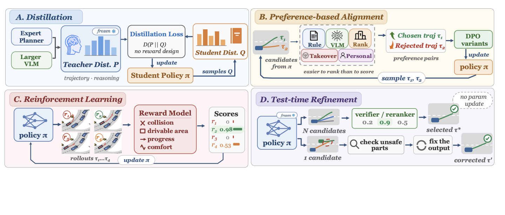

# Awesome Post-Training in Autonomous Driving Papers

[](https://awesome.re)


A curated list of papers on **post-training for end-to-end autonomous driving** — the stage that refines a driving policy *after* imitation learning, using supervision **beyond** offline expert demonstrations. This includes **distillation**, **preference-based alignment**, **reinforcement learning (RL)**, and **test-time refinement**.

This repository accompanies our survey:

> **Post-Training in End-to-End Autonomous Driving: A Unified View**
> Ruining Yang\*, Muxing Wang\*, Yixiao Chen, Tongfei Guo, Yi Xu, Can Cui, Zichong Yang, Yitian Zhang, Ziran Wang, Yun Fu, Lili Su.
> *(\* Equal contribution. Northeastern University & Purdue University.)*

<p align="center">
  
  <br>
  <em>Overview of the four major post-training families for autonomous driving.</em>
</p>

**Why post-training?** Autonomous vehicles operate in safety-critical, interaction-intensive environments where open-loop imitation of expert demonstrations is not enough: small execution errors compound over time, recovery behaviors are scarce in training data, and long-horizon objectives such as safety and comfort are not captured by pointwise labels. Post-training addresses these limitations by refining the policy with richer forms of supervision.

Contributions (new papers, corrections, missing links) are very welcome — please open an issue or a pull request. See [Contributing](#-contributing).

---

## 🧭 Taxonomy

We organize post-training methods into four families by the **form of supervision** they use:

| Family | Supervision signal | Core idea |
| :-- | :-- | :-- |
| **Distillation** | Teacher policy / teacher target | A stronger teacher (expert planner, larger VLM, or EMA copy) provides dense guidance to the student policy. |
| **Preference Alignment** | Preferred–rejected pairs `(yʷ, yˡ)` | The policy is optimized directly from relative comparisons between candidate behaviors (e.g. DPO), without an explicit reward model. |
| **Reinforcement Learning** | Scalar reward `r(õ, y)` | Rewards (rule-based, learned critics, world models, counterfactual, or reasoning-consistency) rank sampled behaviors and drive policy updates (e.g. GRPO/PPO). |
| **Test-time Refinement** | Verifier score `v(o, y)` (no parameter update) | The fixed policy generates candidates that are re-ranked, verified, or self-corrected at inference time. |

Tags used below: **`[Distill]`** · **`[Preference]`** · **`[RL]`** · **`[Test-time]`** · **`[SFT]`** (continued / targeted supervised fine-tuning) · **`[Planner-RL]`** (RL post-training on non-foundation-model planners).

---

## 📌 Contents

- [Papers by Year](#-papers-by-year)
  - [2026](#2026)
  - [2025](#2025)
  - [2024](#2024)
- [Benchmarks & Simulators](#-benchmarks--simulators)
- [Related: Closed-Loop RL from Scratch (contrast)](#-related-closed-loop-rl-from-scratch-contrast)
- [Background: Post-Training in LLMs / Generative Models](#-background-post-training-in-llms--generative-models)
- [Related Surveys](#-related-surveys)
- [Citation](#-citation)
- [Contributing](#-contributing)

---

## 📄 Papers by Year

> Papers are grouped by the year of first public (arXiv) release; the published venue is noted in each entry. A paper is listed under its **primary** family; some methods span multiple families.

### 2026

- **`[RL]`** ThinkDrive: Chain-of-Thought Guided Progressive Reinforcement Learning Fine-Tuning for Autonomous Driving, *arXiv 2026*. [arXiv](https://arxiv.org/abs/2601.04714)
- **`[RL]`** FLARE: Learning Future-Aware Latent Representations from Vision-Language Models for Autonomous Driving, *arXiv 2026*. [arXiv](https://arxiv.org/abs/2601.05611)
- **`[Planner-RL]`** PlannerRFT: Reinforcing Diffusion Planners through Closed-Loop and Sample-Efficient Fine-Tuning, *CVPR 2026*. [arXiv](https://arxiv.org/abs/2601.12901)
- **`[Distill]`** Found-RL: Foundation Model-Enhanced Reinforcement Learning for Autonomous Driving, *Communications in Transportation Research 2026*. [arXiv](https://arxiv.org/abs/2602.10458) [Code](https://github.com/ys-qu/found-rl)
- **`[RL]`** NoRD: A Data-Efficient Vision-Language-Action Model that Drives without Reasoning, *CVPR 2026*. [arXiv](https://arxiv.org/abs/2602.21172) [Code](https://github.com/Applied-Intuition-Open-Source/nord)
- **`[RL]`** MindDriver: Introducing Progressive Multimodal Reasoning for Autonomous Driving, *CVPR 2026*. [arXiv](https://arxiv.org/abs/2602.21952) [Code](https://github.com/hotdogcheesewhite/MindDriver)
- **`[RL]`** PanoEnv: Exploring 3D Spatial Intelligence in Panoramic Environments with Reinforcement Learning, *CVPR 2026*. [arXiv](https://arxiv.org/abs/2602.21992) [Code](https://github.com/7zk1014/PanoEnv)
- **`[Planner-RL]`** HDP: Unleashing the Potential of Diffusion Models for End-to-End Autonomous Driving, *arXiv 2026*. [arXiv](https://arxiv.org/abs/2602.22801) [Code](https://github.com/ZhengYinan-AIR/Hyper-Diffusion-Planner)
- **`[RL]`** ELF-VLA: Unleashing VLA Potentials in Autonomous Driving via Explicit Learning from Failures, *CVPR 2026*. [arXiv](https://arxiv.org/abs/2603.01063) [Code](https://github.com/luo-yc17/ELF-VLA)
- **`[SFT]`** LaST-VLA: Thinking in Latent Spatio-Temporal Space for Vision-Language-Action in Autonomous Driving, *arXiv 2026*. [arXiv](https://arxiv.org/abs/2603.01928) [Code](https://github.com/luo-yc17/LaST-VLA)
- **`[Distill]`** PaIR-Drive: Fine-tuning is not Enough — A Parallel Framework for Collaborative Imitation and Reinforcement Learning in End-to-End Autonomous Driving, *CVPR 2026*. [arXiv](https://arxiv.org/abs/2603.13842) [Code](https://github.com/zhexilian/PaIR-Drive)
- **`[RL]`** TakeVLA: Learning from Mistakes — Post-Training for Driving VLA with Takeover Data, *arXiv 2026*. [arXiv](https://arxiv.org/abs/2603.14972)
- **`[SFT]`** VLM-AutoDrive: Post-Training Vision-Language Models for Safety-Critical Autonomous Driving Events, *arXiv 2026*. [arXiv](https://arxiv.org/abs/2603.18178)
- **`[Preference]`** Drive My Way: Preference Alignment of Vision-Language-Action Model for Personalized Driving, *CVPR 2026*. [arXiv](https://arxiv.org/abs/2603.25740) [Code](https://github.com/tasl-lab/DMW)
- **`[RL]`** Neuro-Cognitive Reward Modeling for Human-Centered Autonomous Vehicle Control, *CVPR 2026*. [arXiv](https://arxiv.org/abs/2603.25968) [Project](https://alex95gogo.github.io/Cognitive-Reward/)
- **`[RL]`** DreamerAD: Efficient Reinforcement Learning via Latent World Model for Autonomous Driving, *arXiv 2026*. [arXiv](https://arxiv.org/abs/2603.24587)
- **`[RL]`** AutoDrive-P³: Unified Chain of Perception-Prediction-Planning Thought via Reinforcement Fine-Tuning, *ICLR 2026*. [arXiv](https://arxiv.org/abs/2603.28116) [Code](https://github.com/haha-yuki-haha/AutoDrive-P3)
- **`[Preference]`** Causal Scene Narration with Runtime Safety Supervision for Vision-Language-Action Driving (CSN), *arXiv 2026*. [arXiv](https://arxiv.org/abs/2604.01723)
- **`[RL]`** ExploreVLA: Dense World Modeling and Exploration for End-to-End Autonomous Driving, *ECCV 2026*. [arXiv](https://arxiv.org/abs/2604.02714) [Project](https://zihaosheng.github.io/ExploreVLA/)
- **`[SFT]`** The Blind Spot of Adaptation: Quantifying and Mitigating Forgetting in Fine-tuned Driving Models, *CVPR 2026*. [arXiv](https://arxiv.org/abs/2604.04857)
- **`[SFT]`** Learning Vision-Language-Action World Models for Autonomous Driving (VLA-World), *CVPR 2026 (Findings)*. [arXiv](https://arxiv.org/abs/2604.09059) [Project](https://vlaworld.github.io/)
- **`[RL]`** SCORP: Scene-Consistent Multi-agent Diffusion Planning with Stable Online Reinforcement Post-Training for Cooperative Driving, *arXiv 2026*. [arXiv](https://arxiv.org/abs/2604.11734)
- **`[RL]`** FeaXDrive: Feasibility-aware Trajectory-Centric Diffusion Planning for End-to-End Autonomous Driving, *arXiv 2026*. [arXiv](https://arxiv.org/abs/2604.12656)
- **`[Planner-RL]`** RAD-2: Scaling Reinforcement Learning in a Generator-Discriminator Framework, *arXiv 2026*. [arXiv](https://arxiv.org/abs/2604.15308) [Project](https://hgao-cv.github.io/RAD-2/)
- **`[Preference]`** CPO++: Towards Robust Endogenous Reasoning — Unifying Drift Adaptation in Non-Stationary Tuning, *arXiv 2026*. [arXiv](https://arxiv.org/abs/2604.15705)
- **`[RL]`** SpanVLA: Efficient Action Bridging and Learning from Negative-Recovery Samples for Vision-Language-Action Model, *arXiv 2026*. [arXiv](https://arxiv.org/abs/2604.19710) [Code](https://github.com/motional/SpanVLA)
- **`[Distill]`** CRAFT: Counterfactual-to-Interactive Reinforcement Fine-Tuning for Driving Policies, *arXiv 2026*. [arXiv](https://arxiv.org/abs/2605.04470) [Project](https://currychen77.github.io/CRAFT/)
- **`[Test-time]`** C-CoT: Counterfactual Chain-of-Thought with Vision-Language Models for Safe Autonomous Driving, *arXiv 2026*. [arXiv](https://arxiv.org/abs/2605.10744)
- **`[RL]`** DIAL: Driving Intents Amplify Planning-Oriented Reinforcement Learning, *arXiv 2026*. [arXiv](https://arxiv.org/abs/2605.12625)
- **`[RL]`** MAPLE: Latent Multi-Agent Play for End-to-End Autonomous Driving, *arXiv 2026*. [arXiv](https://arxiv.org/abs/2605.14201)
- **`[SFT]`** EponaV2: Driving World Model with Comprehensive Future Reasoning, *arXiv 2026*. [arXiv](https://arxiv.org/abs/2605.14696) [Code](https://github.com/JiaweiXu8/EponaV2)
- **`[RL]`** SafeAlign-VLA: A Negative-Enhanced Safe Alignment Framework for Risk-Aware Autonomous Driving, *arXiv 2026*. [arXiv](https://arxiv.org/abs/2605.19524)
- **`[Preference]`** VL-DPO: Vision-Language-Guided Finetuning for Preference-Aligned Autonomous Driving, *ICRA 2026*. [arXiv](https://arxiv.org/abs/2605.20082)
- **`[Distill]`** CoPhy: Distill to Think, Foresee to Act — Cognitive-Physical Reinforcement Learning for Autonomous Driving, *arXiv 2026*. [arXiv](https://arxiv.org/abs/2605.21139)
- **`[Test-time]`** Fast-dDrive: Efficient Block-Diffusion VLM for Autonomous Driving, *arXiv 2026*. [arXiv](https://arxiv.org/abs/2605.23163)
- **`[RL]`** SARAD: LLM-Based Safety-Aware Hybrid Reinforcement Learning with Collision Prediction for Autonomous Driving, *IJCNN 2026*. [arXiv](https://arxiv.org/abs/2605.28583)
- **`[RL]`** BPF: Before Parc Fermé — RL-Time Pruning for Efficient Embodied LLMs in Autonomous Driving, *arXiv 2026*. [arXiv](https://arxiv.org/abs/2605.31256)
- **`[RL]`** DriveAnchor: Progressive Anchor-based Flow Learning for Autonomous Driving Planning, *arXiv 2026*. [arXiv](https://arxiv.org/abs/2606.00519)

### 2025

- **`[Planner-RL]`** RAD: Training an End-to-End Driving Policy via Large-Scale 3DGS-based Reinforcement Learning, *NeurIPS 2025*. [arXiv](https://arxiv.org/abs/2502.13144) [Code](https://github.com/hustvl/RAD)
- **`[RL]`** AlphaDrive: Unleashing the Power of VLMs in Autonomous Driving via Reinforcement Learning and Reasoning, *arXiv 2025*. [arXiv](https://arxiv.org/abs/2503.07608) [Code](https://github.com/hustvl/AlphaDrive)
- **`[Preference]`** TrajHF: Learning Personalized Driving Styles via Reinforcement Learning from Human Feedback, *ICLR 2026*. [arXiv](https://arxiv.org/abs/2503.10434)
- **`[Planner-RL]`** Plan-R1: Safe and Feasible Trajectory Planning as Language Modeling, *ICLR 2026*. [arXiv](https://arxiv.org/abs/2505.17659) [Code](https://github.com/XiaolongTang23/Plan-R1)
- **`[RL]`** DriveMind: A Dual Visual Language Model-based Reinforcement Learning Framework for Autonomous Driving, *arXiv 2025*. [arXiv](https://arxiv.org/abs/2506.00819)
- **`[RL]`** Poutine: Vision-Language-Trajectory Pre-Training and Reinforcement Learning Post-Training Enable Robust End-to-End Autonomous Driving, *arXiv 2025 (1st place, Waymo WOD-E2E Challenge)*. [arXiv](https://arxiv.org/abs/2506.11234)
- **`[RL]`** AutoVLA: A Vision-Language-Action Model for End-to-End Autonomous Driving with Adaptive Reasoning and Reinforcement Fine-Tuning, *NeurIPS 2025*. [arXiv](https://arxiv.org/abs/2506.13757) [Code](https://github.com/ucla-mobility/AutoVLA)
- **`[RL]`** Drive-R1: Bridging Reasoning and Planning in VLMs for Autonomous Driving with Reinforcement Learning, *AAAI 2026*. [arXiv](https://arxiv.org/abs/2506.18234) [Code](https://github.com/Depth2World/Drive-R1)
- **`[RL]`** LaViPlan: Language-Guided Visual Path Planning with RLVR, *ICCV 2025 Workshop*. [arXiv](https://arxiv.org/abs/2507.12911)
- **`[RL]`** DriveAgent-R1: Advancing VLM-based Autonomous Driving with Active Perception and Hybrid Thinking, *ICLR 2026*. [arXiv](https://arxiv.org/abs/2507.20879) [Code](https://github.com/Zwc2003/DriveAgent-R1)
- **`[RL]`** IRL-VLA: Training a Vision-Language-Action Policy via Reward World Model, *arXiv 2025*. [arXiv](https://arxiv.org/abs/2508.06571) [Code](https://github.com/IRL-VLA/IRL-VLA)
- **`[Planner-RL]`** EvaDrive: Evolutionary Adversarial Policy Optimization for End-to-End Autonomous Driving, *arXiv 2025*. [arXiv](https://arxiv.org/abs/2508.09158)
- **`[RL]`** AutoDrive-R²: Incentivizing Reasoning and Self-Reflection Capacity for VLA Model in Autonomous Driving, *ICLR 2026*. [arXiv](https://arxiv.org/abs/2509.01944) [Code](https://github.com/AMAP-ML/AutoDrive-R2)
- **`[RL]`** AdaThinkDrive: Adaptive Thinking via Reinforcement Learning for Autonomous Driving, *ICRA 2026*. [arXiv](https://arxiv.org/abs/2509.13769) [Code](https://github.com/luo-yc17/AdaThinkDrive)
- **`[SFT]`** CoReVLA: A Dual-Stage End-to-End Autonomous Driving Framework for Long-Tail Scenarios via Collect-and-Refine, *arXiv 2025*. [arXiv](https://arxiv.org/abs/2509.15968) [Code](https://github.com/FanGShiYuu/CoReVLA)
- **`[Preference]`** DriveDPO: Policy Learning via Safety DPO for End-to-End Autonomous Driving, *NeurIPS 2025*. [arXiv](https://arxiv.org/abs/2509.17940)
- **`[Test-time]`** ReflectDrive: Discrete Diffusion for Reflective Vision-Language-Action Models in Autonomous Driving, *arXiv 2025*. [arXiv](https://arxiv.org/abs/2509.20109) [Code](https://github.com/pixeli99/ReflectDrive)
- **`[Planner-RL]`** TSA-MPR: Autoregressive End-to-End Planning with Time-Invariant Spatial Alignment and Multi-Objective Policy Refinement, *arXiv 2025*. [arXiv](https://arxiv.org/abs/2509.20938) [Project](https://tisa-dpo-e2e.github.io/)
- **`[Test-time]`** DriveCritic: Towards Context-Aware, Human-Aligned Evaluation for Autonomous Driving with Vision-Language Models, *ICRA 2026*. [arXiv](https://arxiv.org/abs/2510.13108) [Project](https://song-jingyu.github.io/DriveCritic)
- **`[RL]`** VDRive: Leveraging Reinforced VLA and Diffusion Policy for End-to-End Autonomous Driving, *arXiv 2025*. [arXiv](https://arxiv.org/abs/2510.15446)
- **`[RL]`** Alpamayo-R1: Bridging Reasoning and Action Prediction for Generalizable Autonomous Driving in the Long Tail, *arXiv 2025 (NVIDIA)*. [arXiv](https://arxiv.org/abs/2511.00088) [Code](https://github.com/NVlabs/alpamayo)
- **`[SFT]`** Reasoning-VLA: A Fast and General Vision-Language-Action Reasoning Model for Autonomous Driving, *arXiv 2025*. [arXiv](https://arxiv.org/abs/2511.19912) [Code](https://github.com/xipi702/Reasoning-VLA)
- **`[Planner-RL]`** DiffusionDriveV2: Reinforcement Learning-Constrained Truncated Diffusion Modeling in End-to-End Autonomous Driving, *arXiv 2025*. [arXiv](https://arxiv.org/abs/2512.07745) [Code](https://github.com/hustvl/DiffusionDriveV2)
- **`[RL]`** WAM-Diff: A Masked Diffusion VLA Framework with MoE and Online Reinforcement Learning for Autonomous Driving, *arXiv 2025*. [arXiv](https://arxiv.org/abs/2512.11872) [Code](https://github.com/fudan-generative-vision/WAM-Diff)
- **`[Test-time]`** Post-Training and Test-Time Scaling of Generative Agent Behavior Models for Interactive Autonomous Driving, *arXiv 2025*. [arXiv](https://arxiv.org/abs/2512.13262)
- **`[RL]`** OmniDrive-R1: Reinforcement-driven Interleaved Multi-modal Chain-of-Thought for Trustworthy Vision-Language Autonomous Driving, *CVPR 2026*. [arXiv](https://arxiv.org/abs/2512.14044)
- **`[Preference]`** TakeAD: Preference-Based Post-Optimization for End-to-End Autonomous Driving with Expert Takeover Data, *IEEE RA-L 2025*. [arXiv](https://arxiv.org/abs/2512.17370)
- **`[SFT]`** LLaViDA: A Large Language Vision Driving Assistant for Explicit Reasoning and Enhanced Trajectory Planning, *arXiv 2025*. [arXiv](https://arxiv.org/abs/2512.18211)
- **`[Test-time]`** Counterfactual VLA: Self-reflective Vision-Language-Action Model with Adaptive Reasoning, *CVPR 2026*. [arXiv](https://arxiv.org/abs/2512.24426)

### 2024

- **`[Distill]`** VLM-AD: End-to-End Autonomous Driving through Vision-Language Model Supervision, *CoRL 2025*. [arXiv](https://arxiv.org/abs/2412.14446)
- **`[RL]`** Optimizing Autonomous Driving for Safety: A Human-Centric Approach with LLM-Enhanced RLHF, *UbiComp/ISWC 2024 Companion (ACM)*. [arXiv](https://arxiv.org/abs/2406.04481)
- **`[Distill]`** RAPID: Robust RL with LLM-Driven Data Synthesis and Policy Adaptation for Autonomous Driving, *arXiv 2024*. [arXiv](https://arxiv.org/abs/2410.12568)

---

## 📊 Benchmarks & Simulators

Post-training targets closed-loop driving quality, so evaluation increasingly relies on (pseudo-)closed-loop simulators and driving-specific scores.

- **NAVSIM: Data-Driven Non-Reactive Autonomous Vehicle Simulation and Benchmarking**, *NeurIPS 2024 (Datasets & Benchmarks)*. One-shot non-reactive simulation with the PDMS score. [arXiv](https://arxiv.org/abs/2406.15349) [Code](https://github.com/autonomousvision/navsim)
- **Pseudo-Simulation for Autonomous Driving (NAVSIM v2)**, *CoRL 2025*. Two-stage pseudo-closed-loop protocol with the EPDMS score and the `navhard` split. [arXiv](https://arxiv.org/abs/2506.04218) [Code](https://github.com/autonomousvision/navsim)
- **Bench2Drive: Towards Multi-Ability Benchmarking of Closed-Loop End-To-End Autonomous Driving**, *NeurIPS 2024 (Datasets & Benchmarks)*. Fully closed-loop on CARLA with reactive traffic; reports Driving Score (DS) and Success Rate (SR). [arXiv](https://arxiv.org/abs/2406.03877) [Code](https://github.com/Thinklab-SJTU/Bench2Drive)
- **WOD-E2E: Waymo Open Dataset for End-to-End Driving in Challenging Long-Tail Scenarios**, *CVPR 2026*. Long-tail open-loop benchmark with the Rater Feedback Score (RFS). [arXiv](https://arxiv.org/abs/2510.26125) [Code](https://github.com/waymo-research/waymo-open-dataset)
- **nuScenes: A Multimodal Dataset for Autonomous Driving**, *CVPR 2020*. Standard open-loop benchmark (L2 / collision rate). [arXiv](https://arxiv.org/abs/1903.11027) [Code](https://github.com/nutonomy/nuscenes-devkit)
- **nuReasoning: A Reasoning-Centric Dataset and Benchmark for Long-Tail Autonomous Driving**, *arXiv 2026*. NAVSIM-style safety-gated NPS score with 5-second ADE. [arXiv](https://arxiv.org/abs/2605.31572) [Project](https://nureasoning.github.io/)
- **AlpaSim: A Modular, Lightweight, and Data-Driven Research Simulator for Autonomous Driving**, *NVIDIA 2025*. Neural-rendering photorealistic sensor simulation for closed-loop testing. [Code](https://github.com/NVlabs/alpasim)
- **NVIDIA OmniDreams: Real-Time Generative World Model for Closed-Loop Autonomous Vehicle Simulation**, *arXiv 2026*. [arXiv](https://arxiv.org/abs/2606.03159) [Code](https://github.com/nv-tlabs/omni-dreams)

---

## 🔁 Related: Closed-Loop RL from Scratch (contrast)

These methods train policies with closed-loop RL **without** an imitation-learned base policy. They are *not* post-training in our definition, but are closely related and often share reward / world-model machinery.

- **CarPlanner: Consistent Auto-regressive Trajectory Planning for Large-scale Reinforcement Learning in Autonomous Driving**, *CVPR 2025*. [arXiv](https://arxiv.org/abs/2502.19908)
- **Robust Autonomy Emerges from Self-Play (GigaFlow)**, *ICML 2025*. [arXiv](https://arxiv.org/abs/2502.03349)
- **Think2Drive: Efficient Reinforcement Learning by Thinking in Latent World Model for Quasi-Realistic Autonomous Driving (CARLA v2)**, *ECCV 2024*. [arXiv](https://arxiv.org/abs/2402.16720) [Project](https://thinklab-sjtu.github.io/CornerCaseRepo/)
- **Raw2Drive: Reinforcement Learning with Aligned World Models for End-to-End Autonomous Driving (CARLA v2)**, *NeurIPS 2025*. [arXiv](https://arxiv.org/abs/2505.16394) [Code](https://github.com/Thinklab-SJTU/Raw2Drive)

---

## 📚 Background: Post-Training in LLMs / Generative Models

Driving post-training is inspired by the broader LLM / generative-model alignment literature. Key references:

- **Training Language Models to Follow Instructions with Human Feedback (InstructGPT / RLHF)**, *NeurIPS 2022*. [arXiv](https://arxiv.org/abs/2203.02155)
- **Direct Preference Optimization: Your Language Model is Secretly a Reward Model (DPO)**, *NeurIPS 2023*. [arXiv](https://arxiv.org/abs/2305.18290)
- **DeepSeekMath: Pushing the Limits of Mathematical Reasoning in Open Language Models (GRPO)**, *arXiv 2024*. [arXiv](https://arxiv.org/abs/2402.03300)
- **DeepSeek-R1: Incentivizing Reasoning Capability in LLMs via Reinforcement Learning**, *arXiv 2025*. [arXiv](https://arxiv.org/abs/2501.12948)
- **Flow-GRPO: Training Flow Matching Models via Online RL**, *NeurIPS 2025*. [arXiv](https://arxiv.org/abs/2505.05470) [Code](https://github.com/yifan123/flow_grpo)

---

## 📖 Related Surveys

- **Vision-Language-Action Models for Autonomous Driving: Past, Present, and Future**, *arXiv 2025*. [arXiv](https://arxiv.org/abs/2512.16760) [Repo](https://github.com/worldbench/awesome-vla-for-ad)
- **A Survey on Vision-Language-Action Models for Autonomous Driving**, *ICCV 2025 Workshop*. [arXiv](https://arxiv.org/abs/2506.24044) [Repo](https://github.com/SicongJiang/Awesome-VLA4AD)
- **A Survey for Foundation Models in Autonomous Driving**, *ICCVDM 2025*. [arXiv](https://arxiv.org/abs/2402.01105)
- **Beyond Behavior Cloning in Autonomous Driving: A Survey of Closed-Loop Training Techniques**, *2025*.
- **Survey of General End-to-End Autonomous Driving: A Unified Perspective**, *2025*.
- **A Survey on End-to-End Autonomous Driving Training from the Perspectives of Data, Strategy, and Platform**, *IEEE T-ITS 2026*. [Repo](https://github.com/Jiaaqiliu/Awesome-Training-Ecosystem-for-E2E-AD)

---

## 📝 Citation

If you find this repository or our survey useful, please consider citing:

```bibtex
@article{yang2026posttraining,
  title   = {Post-Training in End-to-End Autonomous Driving: A Unified View},
  author  = {Yang, Ruining and Wang, Muxing and Chen, Yixiao and Guo, Tongfei and
             Xu, Yi and Cui, Can and Yang, Zichong and Zhang, Yitian and
             Wang, Ziran and Fu, Yun and Su, Lili},
  journal = {arXiv preprint},
  year    = {2026}
}
```

---

## 🤝 Contributing

Contributions are welcome! To add or fix a paper:

1. Fork this repository.
2. Add the entry under the correct **year**, using the existing format:
   `- **`` `[Tag]` ``** Title, *Venue Year*. [arXiv](url) [Code](url)`
3. Keep entries within a year sorted by arXiv ID (chronological).
4. Open a pull request with a short description.

You can also simply [open an issue](../../issues) to suggest a paper, report a broken link, or correct a venue.

---

## ⭐ Star History

If this list helps your research, please consider giving it a star — it helps others discover it.
